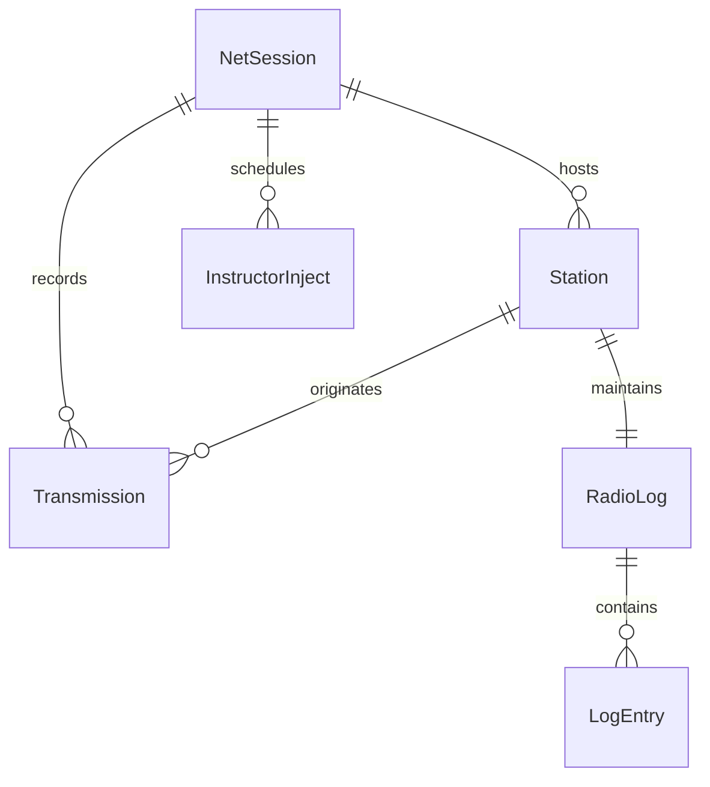

# Domain Model - Relationships: VirtualNet

This document outlines the entity-relationship constraints and model connections in the VirtualNet domain.

## Entity Relationship Diagram

---

## Relationship Details

### 1. NetSession ↔ Station (One-to-Many)
- **Rules**:
  - One `NetSession` hosts many active `Station` records.
  - A `Station` belongs to exactly one `NetSession` at any given time.
  - The server maintains the collection of active connections under the session instance.
  - Call signs within a single `NetSession` must be unique across all active `Station` records.

### 2. NetSession ↔ Transmission (One-to-Many)
- **Rules**:
  - A `NetSession` records a history of multiple `Transmission` records for playback and review.
  - Each `Transmission` is bound to the `NetSession` in which it was broadcast.
  - Only one `Transmission` can have an active stream status at any single point in time (due to half-duplex rules).

### 3. NetSession ↔ InstructorInject (One-to-Many)
- **Rules**:
  - A `NetSession` can have zero or more `InstructorInject` events configured.
  - Injects are executed sequentially or based on a timer offset tracked by the `NetSession` host.

### 4. Station ↔ RadioLog (One-to-One)
- **Rules**:
  - Each `Station` maintaining active participation in the net (excluding "Ghost Mode" Instructors) maintains exactly one `RadioLog` for the session.
  - The `RadioLog` is owned by the station's call sign.

### 5. RadioLog ↔ LogEntry (One-to-Many)
- **Rules**:
  - A `RadioLog` contains zero or more ordered `LogEntry` items.
  - Entries are added sequentially by the operator.
  - When a `Station` is disconnected, their local log entries are preserved locally on the client and optionally synced/uploaded to the server.

### 6. Station ↔ Transmission (One-to-Many / Voice Broadcast)
- **Rules**:
  - A `Station` acts as the originator of zero or more `Transmission` events.
  - When a `Station` originates a `Transmission`, the audio stream is broadcast by the server to all other `Station` instances connected to that `NetSession` (except the originating station to prevent feedback).
